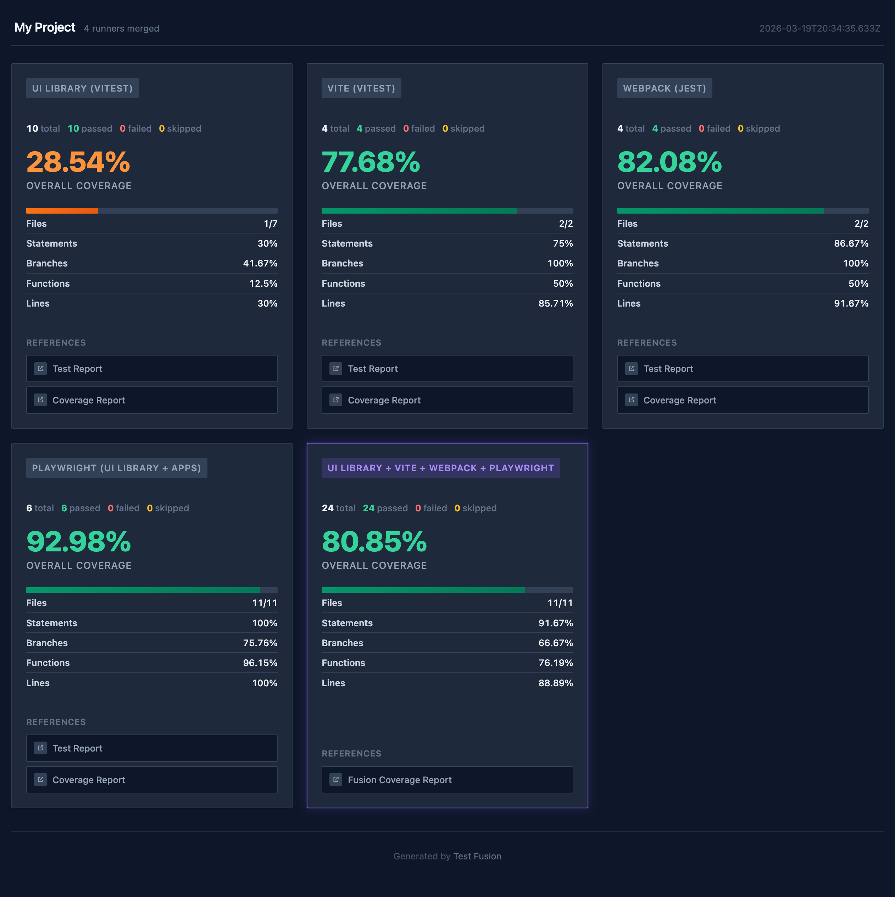

# Test Fusion

Merge test reports and coverage data from multiple test runners into a single HTML dashboard. Supports Jest, Vitest, and Playwright out of the box, with coverage-only support for any Istanbul-compatible runner.



## Why

Most projects have multiple test suites — unit tests, integration tests, E2E tests — each covering different parts of the codebase. Looking at their coverage reports separately doesn't tell you the full picture. Your unit tests might cover 70% of the code, and your E2E tests exercise a completely different 30%. Together that's full coverage, but you'd never know without merging them.

Test Fusion combines Istanbul coverage data from all your test runners into a single report, giving you an accurate picture of what your test suite actually covers.

## Quick Start

### 1. Install

```bash
npm install @test-fusion/core
```

### 2. Set Up Your Test Runners

Each runner needs to output Istanbul coverage data (`coverage-final.json`) and, optionally, JSON test results. Follow the guide for each runner you use:

- [Vitest](#vitest)
- [Jest](#jest)
- [Playwright](#playwright) (requires extra instrumentation)
- [Other runners](#other-runners) (coverage only)

### 3. Configure Test Fusion

Create `test-fusion.config.ts` at your project root. Point it at the coverage and results directories from each runner:

```ts
import { defineConfig } from '@test-fusion/core';

export default defineConfig({
  name: 'My Project',
  rootDir: import.meta.dirname,
  reports: [
    {
      type: 'vitest',
      name: 'Vitest',
      source: {
        coverage: { dir: '<path-to-vitest-coverage-dir>' },
        testReport: { dir: '<path-to-vitest-report-dir>' }, // optional
        testResults: { json: '<path-to-vitest-results.json>' }, // optional
      },
    },
    {
      type: 'playwright',
      name: 'E2E Tests',
      source: {
        coverage: { dir: '<path-to-playwright-coverage-dir>' },
        testReport: { dir: '<path-to-playwright-report-dir>' }, // optional
        testResults: { json: '<path-to-playwright-results.json>' }, // optional
      },
    },
  ],
});
```

| Type | Test results parsing | Use for |
|------|---------------------|---------|
| `vitest` | Vitest JSON output | Vitest |
| `jest` | Jest JSON output | Jest |
| `playwright` | Playwright JSON results | Playwright |
| `other` | None (coverage only) | Node test runner, Mocha, Karma, or any other runner |

`vitest` and `jest` share the same JSON format internally — use whichever matches your runner. Use `type: 'other'` when your test runner outputs Istanbul coverage but doesn't match any of the above. Coverage will be merged into the fusion report; test results (pass/fail counts) will be omitted from the dashboard.

### 4. Generate the Report

```bash
npx test-fusion build                    # Generate HTML dashboard
npx test-fusion build --output ./report  # Custom output directory
npx test-fusion open                     # Serve and open in browser
```

---

## Setting Up Test Runners

### Vitest

Configure Vitest to produce coverage and JSON test results (`vitest.config.ts`):

```ts
import { defineConfig } from 'vitest/config';

export default defineConfig({
  test: {
    coverage: {
      provider: 'v8',
      reporter: ['json', 'html', 'lcov'],
      thresholds: { branches: 80, functions: 80, lines: 80, statements: 80 },
    },
    reporters: ['default', 'json', 'html'],
    outputFile: {
      json: './test-results.json',
      html: './test-report/index.html',
    },
  },
});
```

No additional instrumentation is needed — Vitest handles coverage natively.

### Jest

Configure Jest to produce coverage and JSON test results (`jest.config.js`):

```js
module.exports = {
  collectCoverage: true,
  coverageReporters: ['json', 'html', 'lcov'],
  coverageThreshold: {
    global: { branches: 80, functions: 80, lines: 80, statements: 80 },
  },
};
```

```bash
jest --json --outputFile=./test-results.json
```

No additional instrumentation is needed — Jest handles coverage natively.

### Playwright

Playwright runs tests in a browser, so it doesn't produce Istanbul coverage by default. You need two things: (1) instrument your app so the browser exposes `window.__coverage__`, and (2) collect that data after each test.

#### Step 1: Instrument Your App

Add Istanbul instrumentation to your bundler so `window.__coverage__` is available at runtime. This should only be enabled during CI or when running Playwright — not in production.

**Vite** — using `vite-plugin-istanbul` (works with any framework):

```ts
import { defineConfig } from 'vite';
import istanbul from 'vite-plugin-istanbul';

export default defineConfig({
  plugins: [
    process.env.USE_COVERAGE && istanbul({
      include: ['src/**/*.{ts,tsx}'],
      exclude: ['**/*.test.{ts,tsx}'],
    }),
  ].filter(Boolean),
});
```

**Vite + React** — alternatively, use the built-in Babel integration of `@vitejs/plugin-react`:

```ts
import { defineConfig } from 'vite';
import react from '@vitejs/plugin-react';

export default defineConfig({
  plugins: [
    react({
      babel: {
        plugins: [
          process.env.USE_COVERAGE && ['babel-plugin-istanbul', {
            coverageVariable: '__coverage__',
            include: ['src/**/*.{ts,tsx}'],
            exclude: ['**/*.test.{ts,tsx}'],
          }],
        ].filter(Boolean),
      },
    }),
  ],
});
```

**Webpack:**

```js
module.exports = {
  module: {
    rules: [{
      test: /\.tsx?$/,
      use: [
        process.env.USE_COVERAGE && {
          loader: 'babel-loader',
          options: {
            plugins: [['babel-plugin-istanbul', {
              coverageVariable: '__coverage__',
              include: ['src/**/*.{ts,tsx}'],
              exclude: ['**/*.test.{ts,tsx}'],
            }]],
          },
        },
        'ts-loader',
      ].filter(Boolean),
    }],
  },
};
```

Any bundler that produces Istanbul instrumentation will work — the examples above are just the most common setups.

#### Step 2: Install the Coverage Package

```bash
npm install @test-fusion/playwright-coverage babel-plugin-istanbul
```

#### Step 3: Set Up Coverage Collection

Create four files to wire up the coverage lifecycle: initialize before all tests, collect after each test, finalize after all tests.

**`config/coverage.ts`** — shared instance:

```ts
import { PlaywrightCoverage } from '@test-fusion/playwright-coverage';

export const playwrightCoverage = new PlaywrightCoverage({
  cwd: import.meta.dirname,
  coverageDir: './playwright-coverage',
  collectCoverageFrom: ['src/**/*.{ts,tsx}', '!src/**/*.test.{ts,tsx}'],
});
```

**`config/global-setup.ts`** — initialize coverage (and pass shard info if sharding):

```ts
import type { FullConfig } from '@playwright/test';
import { playwrightCoverage } from './coverage';

export default async function globalSetup(config: FullConfig) {
  await playwrightCoverage.setup(config.shard);
}
```

**`config/global-teardown.ts`** — generate the coverage report:

```ts
import { playwrightCoverage } from './coverage';

export default async function globalTeardown() {
  playwrightCoverage.finish();
}
```

**`fixtures/base.ts`** — collect `window.__coverage__` after each test:

```ts
import { test as base } from '@playwright/test';
import { playwrightCoverage } from '../config/coverage';

export const test = base.extend({
  page: async ({ page, browserName }, use) => {
    await use(page);
    // Collect coverage from one browser only to avoid duplicates across projects
    if (browserName === 'chromium') {
      const coverage = await page.evaluate(() => (window as any).__coverage__);
      playwrightCoverage.addCoverage(coverage);
    }
  },
});
```

Coverage is collected from one browser only (chromium) to avoid duplicates when running tests across multiple browser projects.

#### Step 4: Wire Up `playwright.config.ts`

Point your Playwright config at the global setup/teardown files, and make sure your app is served with `USE_COVERAGE` enabled so the instrumented build exposes `window.__coverage__`:

```ts
import { defineConfig } from '@playwright/test';

export default defineConfig({
  globalSetup: './config/global-setup.ts',
  globalTeardown: './config/global-teardown.ts',

  webServer: {
    command: 'USE_COVERAGE=1 npm run build && npm run preview',
    url: 'http://localhost:4173',
    reuseExistingServer: false,
  },

  // ...
});
```

If your app uses a dev server instead of a static build, pass `USE_COVERAGE` through the `env` option:

```ts
webServer: {
  command: 'npm run dev',
  url: 'http://localhost:5173',
  reuseExistingServer: false,
  env: { USE_COVERAGE: '1' },
},
```

Use the custom `test` from `fixtures/base.ts` in your test files instead of importing from `@playwright/test` directly.

#### Sharding

Coverage collection works with Playwright sharding out of the box. When `config.shard` is passed to `playwrightCoverage.setup()`, the plugin writes per-shard files (`coverage-shard-1.json`, `coverage-shard-2.json`, etc.) instead of a single `coverage-final.json`. When `test-fusion build` runs, it detects and merges them via Istanbul automatically.

See the [Playwright sharding docs](https://playwright.dev/docs/test-sharding) for CI setup examples.

### Other Runners

For any runner that produces Istanbul coverage but isn't Vitest, Jest, or Playwright (e.g. Node test runner, Mocha, Karma), use `type: 'other'`. Coverage will be merged into the report; test results will be omitted from the dashboard.

---

## Monorepo Setup

In a monorepo, each app may instrument shared packages. Set `cwd` to the monorepo root so that coverage paths are relative to the root (not to each app), and use the same `include`/`exclude` patterns across all bundlers so coverage is consistent when merged:

```ts
import path from 'node:path';

const monorepoRoot = path.resolve(import.meta.dirname, '../..');

istanbul({
  cwd: monorepoRoot,
  include: ['packages/**/src/**/*.{ts,tsx}'],
  exclude: ['**/*.test.{ts,tsx}'],
  // ...
});
```

The same applies to `PlaywrightCoverage` — set `cwd` to the monorepo root:

```ts
const cwd = path.resolve(import.meta.dirname, '../../');

new PlaywrightCoverage({
  cwd,
  coverageDir: path.resolve(import.meta.dirname, '../playwright-coverage'),
  collectCoverageFrom: ['packages/**/src/**/*.{ts,tsx}'],
});
```

## Path Normalization

**Important:** For merging to work correctly, coverage from different runners must use consistent file paths. Test Fusion automatically strips `rootDir` from absolute paths to produce relative paths, which handles most cases.

However, when a runner produces paths that don't start with `rootDir`, the automatic stripping won't work. The most common case is Playwright running inside Docker — the coverage JSON contains container paths like `/app/src/Button.tsx`, but `rootDir` on the host is something like `/Users/me/project`. Use `transformPath` in your `test-fusion.config.ts` to strip the container prefix:

```ts
{
  type: 'playwright',
  name: 'Playwright',
  source: { coverage: { dir: './playwright-coverage' } },
  transformPath: (filePath, rootDir) => filePath.replace(/^.*?src\//, 'src/'),
}
```

`PlaywrightCoverage` also supports `transformPath` for normalizing paths at collection time:

```ts
new PlaywrightCoverage({
  cwd: import.meta.dirname,
  coverageDir: './playwright-coverage',
  collectCoverageFrom: ['src/**/*.{ts,tsx}'],
  transformPath: (filePath, cwd) => filePath.replace(/^.*?src\//, 'src/'),
});
```

## Stale Snapshots

Playwright doesn't track whether screenshot snapshots still belong to an existing test. When you rename or delete a test, its snapshot files stay behind in the snapshots directory, silently accumulating over time.

[`@test-fusion/playwright-stale-snapshots`](packages/integrations/playwright-stale-snapshots/) fills this gap. It runs `playwright test --list --reporter=json` to discover which snapshots are expected, compares that with the actual `.png` files on disk, and reports (or deletes) the ones that no longer match any test. It handles Playwright's filename hashing for long test titles, so truncated snapshot names are matched correctly.

```bash
npm install -D @test-fusion/playwright-stale-snapshots

npx playwright-stale-snapshots                        # list stale files (exits 1 if any found)
npx playwright-stale-snapshots --delete               # remove stale files (refused in CI)
npx playwright-stale-snapshots --dir path/to/project  # specify Playwright project directory
npx playwright-stale-snapshots --project chromium     # limit to a single Playwright project
npx playwright-stale-snapshots --snapshots-dir path   # custom snapshots directory
```

> **Note:** Stale snapshot detection relies on snapshot file names being derived from the test title path (the default Playwright behavior). If you pass custom names to `toHaveScreenshot('custom-name.png')`, those snapshots won't be matched and will be reported as stale. This tool is designed for projects that use the default auto-generated snapshot names.

## Contributing

### Sandbox

The `sandbox/` directory contains working example applications for testing the packages locally:

- **`@sandbox/vite-app`** — Vite + React app with Vitest and coverage instrumentation
- **`@sandbox/webpack-app`** — Webpack + React app with Jest and coverage instrumentation
- **`@sandbox/playwright`** — Playwright tests using `@test-fusion/playwright-coverage`
- **`@sandbox/ui`** — Shared UI component library with its own Vitest unit tests

```bash
yarn install
yarn test                 # Build, test everything, generate the fusion report
yarn test -- --sharded    # Same, but Playwright tests run sharded in Docker (requires Docker)
yarn show-report          # Open the report in your browser
```

### Commands

| Command | Description |
|---------|-------------|
| `yarn dev` | Start all dev servers |
| `yarn build` | Build all packages |
| `yarn test` | Full pipeline: build, test, generate report |
| `yarn test -- --sharded` | Same, but Playwright runs sharded in Docker |
| `yarn typecheck` | Type-check all packages |
| `yarn lint` | Lint with Biome |
| `yarn lint:fix` | Auto-fix lint issues |
| `yarn format` | Check formatting with Biome |
| `yarn format:fix` | Auto-format all files |
| `yarn generate-report` | Generate the test-fusion dashboard |
| `yarn show-report` | Serve and open the report |
| `yarn clean` | Remove all build artifacts |

## License

MIT
