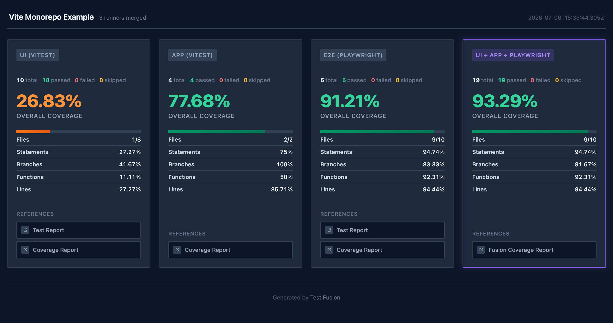

# Test Fusion

Merge test reports and coverage data from multiple test runners into a single HTML dashboard. Supports Jest, Vitest, and Playwright out of the box, with coverage-only support for any Istanbul-compatible runner.

## Why

Most projects have multiple test suites — unit tests, integration tests, E2E tests — each covering different parts of the codebase. Looking at their coverage reports separately doesn't tell you the full picture. Your unit tests might cover 70% of the code, and your E2E tests exercise a completely different 30%. Together that's full coverage, but you'd never know without merging them.

Test Fusion combines Istanbul coverage data from all your test runners into a single report, giving you an accurate picture of what your test suite actually covers.

## Examples

Three self-contained, runnable examples each fuse unit coverage with Playwright E2E coverage over
the **same source**. They run in CI, so their configs stay accurate and serve as the copy-paste
source of truth — see [examples/README.md](examples/README.md) for the full guide to each.

**[vite-mono](examples/vite-mono/README.md)** — Vite monorepo (Vitest UI + app + Playwright E2E)



**[jest-mono](examples/jest-mono/README.md)** — Jest monorepo (Jest UI + app + Playwright E2E)


**[vite-single](examples/vite-single/README.md)** — single package (Vitest + Playwright E2E)


## Quick Start

### 1. Install

```bash
npm install @test-fusion/core
```

### 2. Set Up Your Test Runners

Each runner needs to output Istanbul coverage data (`coverage-final.json`) and, optionally, JSON test results. Follow the guide for each runner you use:

- [Vitest](#vitest)
- [Jest](#jest)
- [Playwright](#playwright) (requires extra instrumentation)
- [Other runners](#other-runners) (coverage only)

### 3. Configure Test Fusion

Create a `test-fusion.config` file (`.ts`, `.js`, `.mjs`, or `.cjs`) at your project root. Point it at the coverage and results directories from each runner:

```ts
import { defineConfig } from "@test-fusion/core";

export default defineConfig({
  name: "My Project",
  rootDir: import.meta.dirname,
  reports: [
    {
      type: "vitest",
      name: "Vitest",
      source: {
        coverage: { dir: "<path-to-vitest-coverage-dir>" },
        testReport: { dir: "<path-to-vitest-report-dir>" }, // optional
        testResults: { json: "<path-to-vitest-results.json>" }, // optional
      },
    },
    {
      type: "playwright",
      name: "E2E Tests",
      source: {
        coverage: { dir: "<path-to-playwright-coverage-dir>" },
        testReport: { dir: "<path-to-playwright-report-dir>" }, // optional
        testResults: { json: "<path-to-playwright-results.json>" }, // optional
      },
    },
  ],
});
```

| Type         | Test results parsing    | Use for                                             |
| ------------ | ----------------------- | --------------------------------------------------- |
| `vitest`     | Vitest JSON output      | Vitest                                              |
| `jest`       | Jest JSON output        | Jest                                                |
| `playwright` | Playwright JSON results | Playwright                                          |
| `other`      | None (coverage only)    | Node test runner, Mocha, Karma, or any other runner |

`vitest` and `jest` share the same JSON format internally — use whichever matches your runner. Use `type: 'other'` when your test runner outputs Istanbul coverage but doesn't match any of the above. Coverage will be merged into the fusion report; test results (pass/fail counts) will be omitted from the dashboard.

### 4. Generate the Report

```bash
npx test-fusion build                    # Generate HTML dashboard
npx test-fusion build --output ./report  # Custom output directory
npx test-fusion open                     # Serve and open in browser
```

---

## Setting Up Test Runners

### Vitest

Vitest emits Istanbul `coverage-final.json` and JSON test results natively — no extra
instrumentation is needed. Use the **Istanbul** coverage provider so its keys align when you
fuse with Playwright over the same files. See the CI-verified
[vite-mono](examples/vite-mono/README.md) and [vite-single](examples/vite-single/README.md)
guides for working `vitest.config.ts` files.

### Jest

Jest emits Istanbul coverage and JSON results natively. If you fuse Jest unit coverage with
Playwright for the **same source files**, instrument with `babel-jest` (not `ts-jest`) so both
paths instrument the original TSX and their statement maps align. See the
[jest-mono](examples/jest-mono/README.md) guide for working `jest.config.cjs` +
`babel.config.cjs` files.

### Playwright

Playwright runs tests in a browser, so it doesn't produce Istanbul coverage by default. You need
two things: (1) instrument your app so the browser exposes `window.__coverage__`, and (2) collect
that data after each test with
[`@test-fusion/playwright-coverage`](packages/integrations/playwright-coverage/README.md).

> **Important:** If you fuse Playwright coverage with unit coverage (Vitest, Jest) for the **same
> source files**, Istanbul must instrument the **original TypeScript source** — not the compiled
> JavaScript. Use `@babel/preset-typescript` together with `babel-plugin-istanbul` in a single
> Babel pass so statement maps use original source line numbers. Approaches that compile
> TypeScript first (e.g. `ts-loader`, `esbuild`, `vite-plugin-istanbul`) produce compiled-JS line
> numbers that cannot be merged correctly with unit coverage. If you don't fuse across the same
> files, those standard approaches work fine.

For complete, CI-verified setups — bundler instrumentation (Vite plugin / Webpack `babel-loader`),
reporter options, the recording fixture, and zero-coverage baselines — see the example guides:

- [vite-mono](examples/vite-mono/README.md) — Vite plugin instrumentation
- [jest-mono](examples/jest-mono/README.md) — Webpack `babel-loader` instrumentation
- [vite-single](examples/vite-single/README.md) — single-package Vite setup

The reporter API (options table, fixture) is documented in
[`@test-fusion/playwright-coverage`](packages/integrations/playwright-coverage/README.md).

#### Sharding

Coverage collection works with Playwright sharding: with `--shard`, the reporter writes per-shard
files (`coverage-shard-1.json`, `coverage-shard-2.json`, ...) and `test-fusion build` merges them
automatically. See the [Playwright sharding docs](https://playwright.dev/docs/test-sharding) and
any example guide for a working Docker setup.

### Other Runners

For any runner that produces Istanbul coverage but isn't Vitest, Jest, or Playwright (e.g. Node test runner, Mocha, Karma), use `type: 'other'`. Coverage will be merged into the report; test results will be omitted from the dashboard.

---

## Fusion vs Aggregation

How you structure your reports determines what the merged number means. There are two shapes:

**Fusion (recommended)** — multiple test _types_ that cover the **same source files**. For
example, unit tests (Vitest/Jest) and E2E tests (Playwright) both exercising
`src/components/**`. Merging unions the covered lines _per file_: if a unit test hits line A
and an E2E test hits line B of the same file, the file shows both as covered. The file
denominator is fixed, so adding a test type can only _raise_ coverage. This is what Test
Fusion is built for.

```
Button.tsx   unit: 40%   e2e: 70%   →   fusion: 95%   (union of covered lines)
```

**Aggregation** — reports that cover **disjoint files** (e.g. separate apps or packages in
different directories). Merging here is really a union of _different files_, so the merged
number is a weighted average across unrelated code. Adding a weakly-tested area **dilutes**
the overall percentage, and the file denominator grows. This works, but you don't need Test
Fusion's per-file merging for it — a plain `lcov` merge does the same thing.

Rule of thumb: point Test Fusion at **one coherent source scope covered by several test
types** (fusion). In a monorepo that wants a single number, prefer running **one fusion per
package** and aggregating those separately, rather than mixing packages into one denominator.

## Monorepo Setup

In a monorepo, each app may instrument shared packages. Set `cwd` to the monorepo (or example)
root — in **both** your bundler's Istanbul config and the coverage reporter options — so coverage
paths are relative to that root rather than each app, and use the same `include`/`exclude`
patterns across all bundlers so keys match when merged. The
[vite-mono](examples/vite-mono/README.md) and [jest-mono](examples/jest-mono/README.md) guides
show this end to end.

## Path Normalization

**Important:** For merging to work correctly, coverage from different runners must use consistent file paths. Test Fusion normalizes each key by stripping the `rootDir` prefix to produce a relative path. That's the only transform it applies — so as long as every runner emits paths under the same `rootDir`, keys line up and fuse automatically.

Any path that doesn't start with `rootDir` is left as-is (aside from dropping a leading slash). This happens when coverage is produced somewhere whose paths differ from where fusion runs — most commonly Playwright running inside Docker, where the coverage JSON contains container paths like `/app/project/src/Button.tsx` while `rootDir` on the host is `/Users/me/project`. In that case, normalize the paths yourself with `transformPath` so they become relative to `rootDir`.

Use `transformPath` in your `test-fusion.config.ts` to strip the prefix explicitly:

```ts
{
  type: 'playwright',
  name: 'Playwright',
  source: { coverage: { dir: './playwright-coverage' } },
  transformPath: (filePath, rootDir) => filePath.replace(/^.*?src\//, 'src/'),
}
```

The coverage reporter also supports `transformPath` for normalizing paths at collection time:

```ts
const coverageOptions = {
  cwd: import.meta.dirname,
  coverageDir: "./playwright-coverage",
  transformPath: (filePath, cwd) => filePath.replace(/^.*?src\//, "src/"),
  projects: [
    {
      collectCoverageFrom: ["src/**/*.{ts,tsx}"],
    },
  ],
};
```

## Contributing

### Examples

The [examples](examples/README.md) double as the repo's integration tests (`yarn test`). Run them
locally:

```bash
yarn install
yarn example:vite-mono     # Run the Vite monorepo example end to end + fuse
yarn example:jest-mono     # Run the Jest monorepo example end to end + fuse
yarn example:vite-single   # Run the single-package example end to end + fuse
yarn show:vite-mono        # Open the Vite monorepo example's fused report
yarn test                  # Full pipeline: all examples + stale-snapshots checks
yarn test -- --sharded     # Same, but each example's Playwright runs sharded in Docker
yarn test -- --only vite-mono   # Run just one example (optionally add --sharded)
```

### Commands

| Command                     | Description                                                    |
| --------------------------- | ------------------------------------------------------------- |
| `yarn test`                 | Full pipeline: all examples, stale-snapshots, fusion reports  |
| `yarn test -- --sharded`    | Same, but each example's Playwright runs sharded in Docker     |
| `yarn test -- --only <name>`| Run a single example (`vite-mono`/`jest-mono`/`vite-single`)   |
| `yarn test -- --verbose`    | Full pipeline with detailed output                            |
| `yarn example:vite-mono`    | Run the Vite monorepo example (unit + build + E2E) and fuse   |
| `yarn example:jest-mono`    | Run the Jest monorepo example (unit + build + E2E) and fuse   |
| `yarn example:vite-single`  | Run the single-package example (unit + build + E2E) and fuse  |
| `yarn report:vite-mono`     | Fuse the Vite monorepo example's existing reports             |
| `yarn report:jest-mono`     | Fuse the Jest monorepo example's existing reports             |
| `yarn report:vite-single`   | Fuse the single-package example's existing reports            |
| `yarn show:vite-mono`       | Serve and open the Vite monorepo example's report            |
| `yarn show:jest-mono`       | Serve and open the Jest monorepo example's report            |
| `yarn show:vite-single`     | Serve and open the single-package example's report            |
| `yarn build`                | Build all packages                                           |
| `yarn typecheck`            | Type-check all packages                                      |
| `yarn lint`                 | Lint with Biome                                              |
| `yarn lint:fix`             | Auto-fix lint issues                                         |
| `yarn format`               | Check formatting with Biome                                  |
| `yarn format:fix`           | Auto-format all files                                        |
| `yarn clean`                | Remove all build artifacts                                   |

## License

MIT
