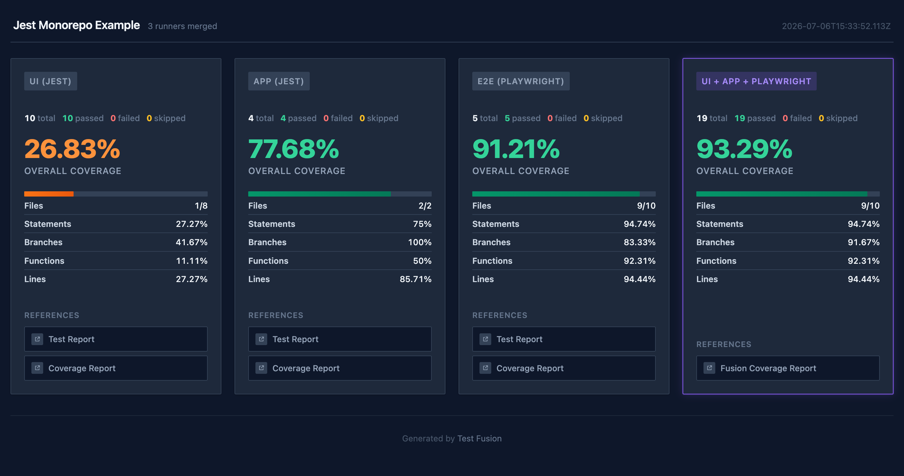

# jest-mono — Jest monorepo example

A monorepo where a UI library and an app are both unit-tested with **Jest**, and a separate
Playwright workspace runs **E2E** against the Webpack-built app. All three reports cover the same
`ui/**` + `app/**` source and fuse per file.

Unit tests cover only part of the UI; the E2E run exercises the rest. The fused report unions
them per file (~93%), while a component that nothing renders stays uncovered — the point of
fusion. See the [main README](../../README.md#fusion-vs-aggregation) for the concept.



## Layout

| Workspace | Role |
| --------- | ---- |
| `@ex-jest-mono/ui` | UI component library, unit-tested with Jest |
| `@ex-jest-mono/app` | App that renders the UI, unit-tested with Jest, built with Webpack |
| `@ex-jest-mono/playwright` | Playwright E2E driving the built app |

## How coverage is collected and fused

The key rule: every runner instruments the **original TSX** with `babel-plugin-istanbul` so the
statement maps line up and fuse per file (see the [main README](../../README.md#playwright)). Jest
uses `babel-jest` (not `ts-jest`) so unit coverage instruments the same original source as the
Webpack build and Playwright — otherwise the statement maps would not align.

- **Unit coverage** — Jest via `babel-jest`, sharing Babel presets with the build:
  [ui/jest.config.cjs](ui/jest.config.cjs), [ui/babel.config.cjs](ui/babel.config.cjs),
  [app/jest.config.cjs](app/jest.config.cjs), [app/babel.config.cjs](app/babel.config.cjs).
- **Instrumented build** — a single `babel-loader` (with `@babel/preset-typescript`) instruments
  the source, gated on `USE_COVERAGE`: [app/webpack.config.mjs](app/webpack.config.mjs).
- **E2E coverage collection** — the Playwright coverage reporter plus a zero-coverage baseline
  (so untested components appear at 0%), with `cwd` set to the example root so keys are relative:
  [playwright/coverage.options.ts](playwright/coverage.options.ts),
  [playwright/playwright.config.ts](playwright/playwright.config.ts).
- **Fusion** — the three reports are wired together in
  [test-fusion.config.ts](test-fusion.config.ts).

## Run it

```bash
yarn example:jest-mono     # unit + build + E2E, then fuse
yarn show:jest-mono        # open the fused report
```

Or sharded across Docker (this example only):

```bash
yarn test -- --only jest-mono --sharded
```

## Visual snapshots

The Playwright suite includes visual snapshot tests and doubles as a fixture for the
[`@test-fusion/playwright-stale-snapshots`](../../packages/integrations/playwright-stale-snapshots/README.md)
integration test.
