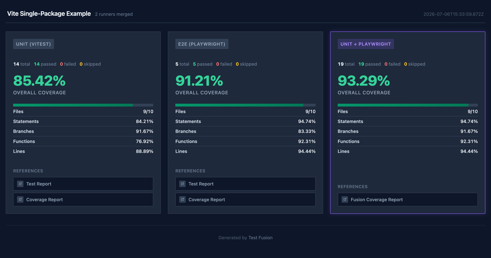

# vite-single — single-package example

A single package (`@ex-vite-single/app`) where components, **Vitest** unit tests, and
**Playwright** E2E all live together and fuse coverage over one `src/**` tree. This is the
non-monorepo shape: one repo, one source, two test types.

Unit tests cover only part of the UI; the E2E run exercises the rest. The fused report unions
them per file (~93%), while a component that nothing renders stays uncovered — the point of
fusion. See the [main README](../../README.md#fusion-vs-aggregation) for the concept.



## Layout

Everything is one package:

- `src/` — components + app + Vitest unit tests
- `e2e/` — Playwright tests, fixtures, and page objects
- `playwright.config.ts` and `snapshots/` live at the package root so the tooling works with
  defaults

## How coverage is collected and fused

The key rule: both runners instrument the **original TSX** with `babel-plugin-istanbul` so the
statement maps line up and fuse per file (see the [main README](../../README.md#playwright)).

- **Unit coverage** — Vitest uses the Istanbul provider so its keys match the E2E keys:
  [vitest.config.ts](vitest.config.ts).
- **Instrumented build** — a `enforce: 'pre'` Vite plugin instruments the source before esbuild,
  gated on `USE_COVERAGE`: [vite.config.mts](vite.config.mts).
- **E2E coverage collection** — the Playwright coverage reporter plus a zero-coverage baseline
  (so untested components appear at 0%), with `cwd` set to the package root:
  [coverage.options.ts](coverage.options.ts), [playwright.config.ts](playwright.config.ts).
- **Fusion** — the two reports are wired together in
  [test-fusion.config.ts](test-fusion.config.ts).

## Run it

```bash
yarn example:vite-single   # unit + build + E2E, then fuse
yarn show:vite-single      # open the fused report
```

Or sharded across Docker (this example only):

```bash
yarn test -- --only vite-single --sharded
```

## Visual snapshots

The Playwright suite includes visual snapshot tests and doubles as a fixture for the
[`@test-fusion/playwright-stale-snapshots`](../../packages/integrations/playwright-stale-snapshots/README.md)
integration test.
